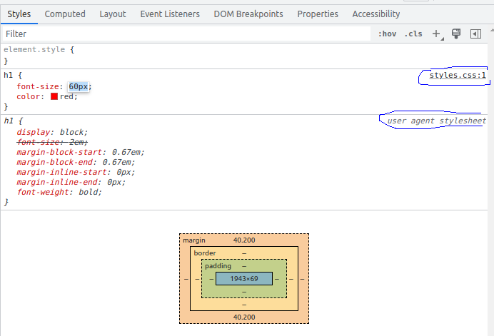
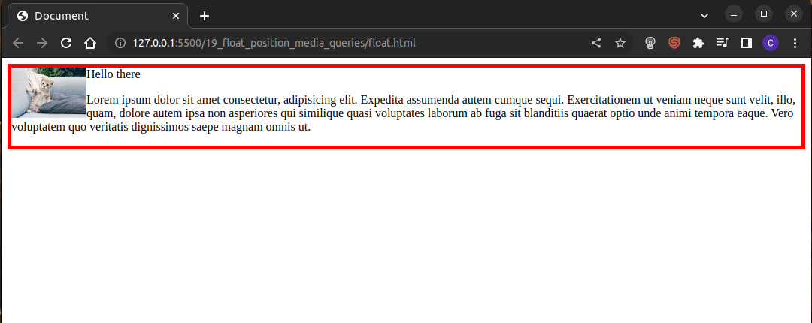
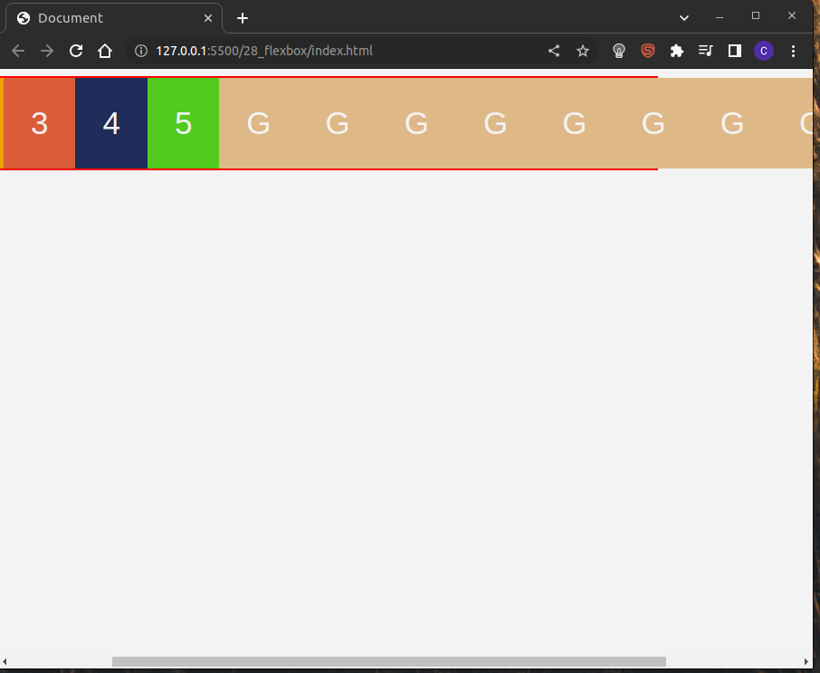
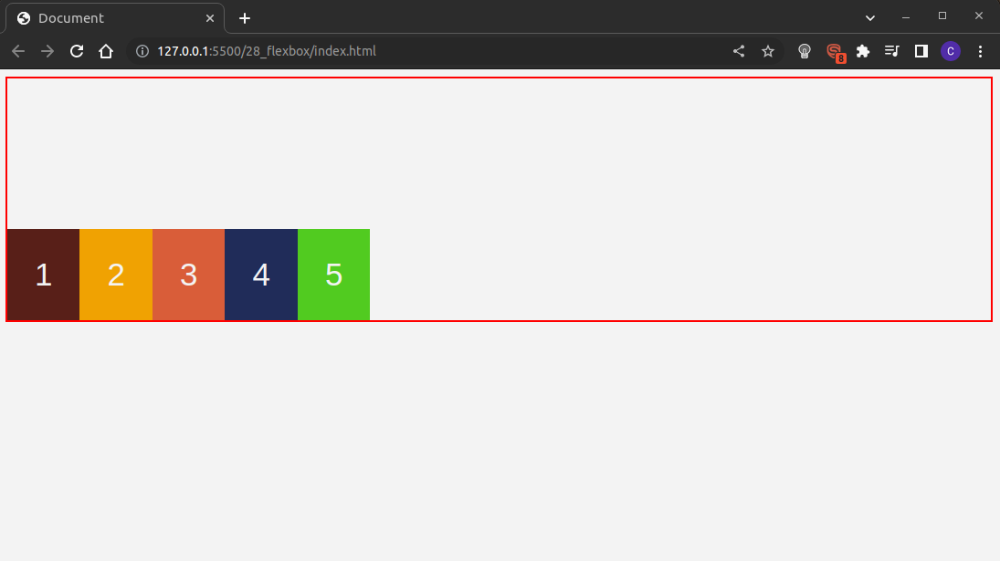

# VS code
### extensions
- live server
- auto rename tag
- highlight matching tag
### shortcuts
- (CTRL + K V) opens markdown preview side by side 
- (CTRL + B) opens/closes sidebar
- (CTRL + L) selects whole current line
- (ALT + arrow up/down) moves line up/down
- (CTRL + D) select instances
- (CTRL + K W) closes all open tabs/windows

# Emmet
[docs](https://docs.emmet.io/)
- Exclamation mark (!) creates basic HTML structure
- element, followed by tab automatically creates both opening and closing tab, so for example type "h1", hit Tab and you get `<h1></h1>`
- `link:css` creates `<link>` to stylesheet
- `h1{hello world}*5` creates `<h1>hello world</h1>` 5 times
- `lorem20` generates lorem text with 20 words


<br>

# Useful resources
### Images
Copyright-free high-quality images
- [pexels](https://www.pexels.com/)
- [pixabay](https://pixabay.com/)
- [gratisography - funny images](https://gratisography.com/)
### Colors
Color palettes, schemes, gradients
- [coolors](https://coolors.co/)
Linear gradients
- [colorzilla](https://www.colorzilla.com/gradient-editor/)

# Patterns / often used

## Overriding browser defaults

```
* {
  margin: 0;
  padding: 0;
  box-sizing: border-box;
}
```

## Setting linear gradient overlay on hero element

Increases readability of stuff we have over our hero element.

## Setting fonts for whole body and overriding for specific elements

Self explanatory.

## 1px solid red border for debugging

Self explanatory.

### centering without grid/flexbox

For block level elements `margin-left: auto`, `margin-right: auto`
For inline elements, select parent and `text-align: center`

## section-center

When setting up a section on our site, it can be a good idea to set up an outer `section` div and then an inner `section-center` div. Then we can make our section span the whole width of the screen, and the section-center can have a more limited width. See this example:

```
<body>
  <div class="section">
    <div class="section-title">
      <h1>section title</h1>
      <div class="title-underline"></div>
    </div>
    <div class="section-center">
      <p>Lorem ipsum dolor sit, amet consectetur adipisicing elit. Qui culpa, aliquam ex sint labore suscipit et possimus, obcaecati deleniti eum fugiat dolores dolor eaque consectetur recusandae! Aliquid repellat totam optio, corporis quod nesciunt suscipit odit repellendus natus veritatis, debitis adipisci voluptatum ratione doloribus ea sint modi commodi impedit fugiat pariatur?</p>
    </div>
  </div>
</body>
</html>

.section {
  padding: 3rem;
  background: #fff;
}

.section-center {
  width: 90vw;
  max-width: 1170px;
  margin-left: auto;
  margin-right: auto;
}
```

This way we can limit the width of our content, so it doesn't span the whole width. While simultaneously having the section span the whole width. With the section-center, we can achieve a look like this:


Without section center, we can get either this, if we apply the styles (width and max-width) of section-center to section directly:


Or like this, if we don't include section-center or its styles at all and just have section:


## border-radius to get circular elements

If we want to create a circular button, or other element, a good way to do it is to give it `border-radius` of value equal to its `height` and `width`. 

## putting images into divs

see explanation [here](#more-useful-example-and-general-image-pattern), it's pretty long so I did not want to put it here.

## covering a parent element/div

see [here](#inset-property-and-covering-one-element-with-another)

## centering with flexbox

Make the parent element a flex container, and then set `align-items: center` and `justify-content: center`

## using `align-items: baseline` for vertical alignment of items in navbar with logo

If we have a navbar where there is a logo which has a different size than the rest of the elements, we can align our elements vertically with `align-items: baseline` which will align according to content of children, not where their box starts.

# CSS

### External vs internal vs inline
- last rule principle - if we have multiple styles given to the same property of the same element, the one that was defined "most recently" will be applied. If there is an inline style, it will be the inline style. If there isn't an inline style, external vs internal actually depends on the exact placement of the `<link>` and `<styles>` tags in the document. Consider the examples below:
```
<head>
  <link rel="stylesheet" href="./styles.css">
  <style>
    h1 {
      color: green;
    }
    </style>
  <title>Document</title>
</head>
```
```
<head>
  <style>
    h1 {
      color: green;
    }
    </style>
    <link rel="stylesheet" href="./styles.css">
  <title>Document</title>
</head>
``` 
#### **order matters when linking stylesheets**

In the first example, the internal styling in the `<style>` tags is defined after the `<link>` to the external style sheet. Therefore, the internal style will apply. However, in the second example, the external style will be applied, because the `<link>` is defined after the internal styling.

This raises an important point to `<link>`ing of external stylesheets. Generally, if we are using external stylesheets from 3rd party sources (for example bootstrap), as well as our own external stylesheets, we want to link our own stylesheets last, as this will allow us to override any styles defined in the previous third party stylesheets.

### selectors

```
/*We can group selectors with a comma*/
h1, h2, h3 {

}

.class {

}

#id {

}

/* (any) descendant selector - only selects <p> which is inside .container */
.container p {

}

/* direct descendant selector */
.container > p {

}

/* combination of classes selector - will only be applied if both classes present */
.container.special-container {

}
/* universal selector */ 
* {
  margin:0;
  padding: 0;
  box-sizing: border-box
}

/* selects first line of paragraph */
p::first-line {
  font-weight: bold;
}

/*selects first letter of paragraph */
p::first-letter {
  color: red;
}

/* apply style on mouse hover */
button:hover {

}

/* selects the root document, usually <html>. typically used to declare CSS variables */
:root {

}
```

### inheritance
- In CSS, children inherit styles from the parent, unless they have their own style. More immediate parents take priority over less immediate parents, so if a `<p>` element is in a `<div>` which is inside the `<body>`, and both the div and body have a style specified for a given property, the style from the div would prevail, because it's the more immediate parent.
- However, not all properties are inherited, for example `border` is not inherited.


### order matters when specifying different styles for the same element/property
<br>

```
p {
  color: blue
}

thousands of line of code

p {
  color: red
}
```
If we have a situation similar to the example above, where we define different values for the same style and property, the last defined rule will take precedent.

### Specificity
Broadly speaking, id is most specific, then class, then type (of element). For a more thorough description, see [MDN](https://developer.mozilla.org/en-US/docs/Web/CSS/Specificity). For conflicting properties, the more specific selector prevails.


### Colors
#### properties
Two properties of interest: `color` and `background-color`. They are self-explanatory. One interesting thing is that there's also the `background` property, which can be used to set color, or a background image, or some kind of combination.
#### values
The simplest way of setting values for colors is just typing the **name** of the color. You can see all CSS named colors [here](https://www.w3schools.com/colors/colors_names.asp).

The next possibility is to specify **RGB** values. This is done using the following syntax:
```
#black {
  color: rgb(0, 0, 0)
}
#white {
  color: rgb(255, 255, 255)
}
# red {
  color: rgb(255, 0, 0)
}
```
Each of the three *primary colors of light* - red, green and blue - are added together in various ways (given a value of 0 - 255) to reproduce a broad array of colors.


We also have the possibility of specifying **RGBA** values. Where RGB uses a 3-tuple of red, green and blue, RGBA adds another value, it is a 4-tuple, where the last value specifies the transparency/opacity of the color, ranging from 0 to 1. The typical use of RGBA is to use an overlay on a background image, to improve the legibility of the text on the image.

#### VS code color help
If we mouse over a color in our CSS, we get the color picker as shown below. We can choose a color anywhere on the palette, and VS code will set the value for us. Additionally, we can click on the color value at the top of the picker (#ff0000) in order to switch between hex/rgb/hsl values for the same color.


### Units

Two main types of units in CSS - relative and absolute. 
#### %
One example of relative units are percentage units. Percentage units are relative and **depend on the size of the parent**.

```
some HTML

<div id="outer">
  <div id="inner"></div>
</div>

#outer {
  width: 300px;
}

#inner {
  width: 50%
}
```
The example above illustrates that when using percentage units, the actual, absolute size depends on the size of the parent. So in the example above, the inner div would have a width of 150px.

#### em
The em is a relaive unit also, it depends on the parent. The way it works is that the em value, such as `1 em`, `2 em` etc, is multiplied by a base value. The base value is given either by a parent element, or the user's browser settings if there is no parent element, or the parent element does not specify font size. 
```
<div>
  <h3>My heading</h3>
</div>

div {
  font-size: 10px;
}

h3 {
  font-size: 2em
}

```
In the example above, the h3 would have a font size of 20px. If the heading did not have a parent element, or if its parent element did not specify a font-size, then it would depend on the user's browser font size settings.
#### rem
These are similar to `em` units, but rather than being dependent on the parent, they are dependent on the root - which is the browser font setting (unless we override the font-size of the `<html>` root element).

#### vh and vw
These are viewport units - vh being viewport height and vw being viewport width. Their values range from 0 to 100, where 100 takes up the whole screen (whatever the screen size).

### Default browser styles and Chrome dev tools
Chrome dev tools are very useful in web dev. 


Above, we see two features highlighted - in red, is an element selector - we can use it to select any element on the page by clicking, and Chrome will navigate to it in the Elements tab. In blue is the Toggle device toolbar, which allows us to simulate viewing the page on various devices/screen sizes.


And here we can see a demonstration of default browser styles. Even though the page we set up has just an `<h1>` element, and absolutely no styling in CSS, the `h1` still has some styles, as we can see in the dev tools. These are the default browser styles. These are the styles the browser falls back to if the developer doesn't specify any themselves.



In the dev tools it also specifically shows us the sources of various styles. `user-agent-stylesheet` means default browser styles. For styles which are not browser defaults, we can even override the directly in the devtools, as is shown with font-size. This is useful for quick prototyping/checking.

### calc function

The calc function allows us to define sizes in terms of calculations. Best shown on an example:

```
<body>
  <ul class="navbar">
    <li>simple link</li>
  </ul>
  <div class="banner"></div>
</body>

* {
  margin: 0;
}

.navbar {
  background: blue;
  height: 100px;
  color: white;
  font-size: 3rem;
}

.banner {
  height: calc(100vh - 100px);
  background: red;
}
```

If we wanted to create a webpage with a navbar on top and then a hero element below, such that they take up the whole screen together vertically, without scrolling, `calc` is the ideal tool. We can set a given height for the navbar, and then for the hero element we can express its height in terms of `calc(100vh - {navbar-height}px)`

### Overflowing content, min-height

When we specify a height for an element, such as a `<div>`, we can run into problems with content overflow. If we continue with the example right above and add another div, specify some height and put some content inside, we will get something like the following:
```
<ul class="navbar">
  <li>simple link</li>
</ul>
<div class="banner"></div>
<div class="example">
  <p>hello world</p>
  <p>Lorem ipsum dolor, sit amet consectetur adipisicing elit. Reiciendis natus iusto modi, tempora placeat voluptatibus? Repellendus maxime repudiandae illum quos. </p>
  <p>hello world</p>
</div>

* {
  margin: 0;
}

.navbar {
  background: blue;
  height: 100px;
  color: white;
  font-size: 3rem;
}

.banner {
  height: calc(100vh - 100px);
  background: red;
}

.example {
  background: green;
  width: 20rem;
  height: 25rem;
}
```

And the bottom of the page looks like this in the browser:


However, if we add more text into the green div, the following happens:


The text is overflowing out of our `<div>`, since we gave it a specific height of 25rem, but the text does not fit within that. 

#### overflow
We have a few options here. We could either deal with it using the `overflow` property. We could specify `overflow: hidden;`, which would cut off all the text flowing over the bottom of the div, though that's obviously not a good solution. Alternatively, we could specify `overflow: scroll`, which would keep the height of the div to 25rem, and add a scrollbar so that we can optionally view all the text. 

#### min-height
Alternatively, we could change the div to have `min-height: 25rem`, rather than `height: 25rem`. The div would then have a height of 25rem when its content (text) fits within the 25rem height, but its height would automatically increase to contain all of the text if it did not fit within the 25rem height.

### Typography

Two properties are key for typography - `font-size` and `font-family`. Additionally, we will look at how to use Google Fonts.

**Pattern**: setting a font-family for the whole body, and then overriding for specific elements/headings.

#### Font-stack and generic fonts
It could happen that a given browser does not support a given specific font that we have chosen. In that case, we can supply fallback options. Supplying multiple different fonts, ending with a generic font classification. This is called a font stack. VS code suggestions include some font stacks.

```
h1 {
  font-family: 'Franklin Gothic Medium', 'Arial Narrow', Arial, sans-serif;
}

p {
  font-family: 'Courier New', Courier, monospace;
}
```

Notice that fonts whose names consist of multiple words are written in quotation marks.

#### Google Fonts

We can use fonts from external sources, such as Google Fonts. There are many fonts to choose from, and usually there are also many versions of the same font, with different thickness, cursive vs regular and so on.


In the bar on the right side, we can see three fonts selected: Merriweather, Lato and Roboto Condesed. Google Fonts then provides two ways to link the fonts to your website, either via a `<link>` tag to include in your HTML, or via an `@import` statement to include in your CSS (provided under **Use on the web**). They also give you the exact CSS rules to specify the font families you have chose (provided under **CSS rules to specify families**). Note that they also include fallback fonts, should the Google Fonts not load.

**Keep in mind**: the more Google Fonts you'll use/include on your site, the slower it will load, since they all need to be requested from Google's servers. Additionally, using the `<link>` way of importing the fonts is [quicker](https://sia.codes/posts/making-google-fonts-faster/) than the CSS way.

#### System fonts

System fonts are fonts which are already included on the user's device. Note that this will make the site look different on different OS devices. To use system fonts, just start typing "system-ui" after the font-family, and VS code should auto complete.

```
body {
  font-family: system-ui, -apple-system, BlinkMacSystemFont, 'Segoe UI', Roboto, Oxygen, Ubuntu, Cantarell, 'Open Sans', 'Helvetica Neue', sans-serif;
}
```

#### font-weight and font-style

The `font-weight` property determines the boldness of our font. We can either specify it using numeric values, ranging from 1 to 1000, though usually the values are specified to the nearest hundred (100, 200 etc). Alternatively it can be specified using keywords `normal` and `bold`, or keyword values relative to the parent `lighter` and `bolder`.

With `font-style` we can specify either `italic`, `oblique` or `normal`.

#### More properties

For `text-align`, we can set either `right`, `left` or `center`.

For `text-indent`, we can set a size in units (px, rem etc.), which will make the text start indented by a certain amount.

For `line-height` we can set a size in units, or we can just put a unitless number, which will make the line-height be a multiple of the font-size.

For `letter-spacing` we can set a size in units.

For `word-spacing` we can set a size in units.

For `text-decoration` we can set `dashed`, `dotted`, `underline`, `none` and others. 

For `text-transform` we can use `uppercase`, `capitalize` or `lowercase`.

### CSS box model

Every HTML element is in a box. Boxes have their content, padding, borders and a margin:


#### shorthand

When we define `padding` or `margin` for our element, we can either separately specify properties for `padding-top`, `padding-bottom`, `padding-left` and `padding-right`. Or, we can use a shorthand, like this:
```
/* adds 2rem padding all around */
h1 {
  padding: 2rem;
}

/* adds 2 rem padding top and bottom and 4rem padding left and right
div {
  padding: 2rem 4rem;
}

/* adds 1rem top, 2rem right, 3rem bottom and 4rem left
h2 {
  padding: 1rem 2rem 3rem 4rem;
}
```

For borders, we have the following shortcuts:

```
/* width, style, color */
div {
  border: 1px solid red;
}
/* specific side of the border */
div {
  border-bottom: 1rem dashed green;
}
```

#### margin

By default, browser already has a margin. So we usually will want to add the following to all our projects:
```
* {
  margin: 0;
}
```

**Margin collapse**: margins collapse. This means that if we have two elements, one on top of the other, if we set margin-bottom for the top element and a margin-top for the bottom element, these margins do not add up together. Only the larger of the two margins is considered. 

**Negative margin**: We can also give a negative margin to elements, which will make one element cover another element.

#### outline

Our previous CSS box model image was actually missing the outline:


The outline behaves basically the same as the border, but it has one additional property which we can use to make interesting designs - `outline-offset`.

```
#one {
  border: 0.2rem solid black;
}

#two {
  outline-width: 0.2rem;
  outline-color: black;
  outline-style: solid;
  outline-offset: 10px;
}
```


### Display property

All elements have a default value for the display property. There are two main values:
- `block` these elements always start a new line and span the full width of the screen
- `inline` these elements do not start a new line and span only content. The browser does not respect their height, width, top and bottom margins.
- `inline-block` these elements also do not start a new line, but the browser does respect their width, height and top and bottom margins.

However, we can override this default behaviour by setting the property to the value we want.

#### horizontal centering

- For inline elements, in order to center them, we need to target their parent element and set `text-align: center`. For a block element, this will just center the text within the element, but it won't center the element within its parent.


- For block elements, we first need to give them a width and then given them a margin-left and margin-right of auto. If we only give them margin-left of auto, it will align the element to the right and vice versa. Setting both will center the element.

#### width, height, margin-top and margin-bottom

- For block elements, the browser respect the width, height, margin-top and margin-bottom properties. However, for inline elements, setting a value for these properties will not actually affect anything. 
- We can fix this by setting `display: inline-block` for these elements.

#### box-sizing

We often add `box-sizing: border-box;` to our universal styles. The default value for `box-sizing` is `content-box`. The `box-sizing` property changes how padding affects the width and height of our element. If we have the default `content-box` setting, and we add padding of 20px to a div which has a height of 200px and a width of 200px, the actual size of the div will be 240px by 240px. If we seet `box-sizing: border-box` however, the div will remain 200px by 200px.

```
<body>
  <div class="box-1">I'm with border-box</div>
  <div class="box-2">I'm normal</div>
  <div class="box-3">I'm without border-box</div>
</body>
```

```
.box-1, .box-2, .box-3 {
  width: 200px;
  height: 200px;
  color: white;
  font-size: 2rem;
}

.box-1 {
  background: red;
  padding: 20px;
  box-sizing: border-box;
}

.box-2 {
  background: blue;
}

.box-3 {
  background: green;
  padding: 20px;
}
```


#### hiding elements

We can hide elements in a couple of different ways.

- Setting `display: none` removes the element from the DOM. Its space is collapsed/taken up by the other elements.
- Setting `opacity: 0` will make the element transparent, but leave it in the DOM and it will still take up space.
- Setting `visibility: hidden` will hide the element, but leave it in the DOM and it will still take up space.

### (Background) images

To set an image as background, we use the following syntax `background: url(<path to image>)`

By default, our image will repeat itself in both x and y directons. We can control this behaviour using the `background-repeat` property. This can take the values of `repeat`, `no-repeat`, `repeat-x`, `repeat-y`, `space` and `round`. `space` will put some space around the background image, and `round` will repeat the image as soon as another image fits.


An example of `background-repeat` values of `space` and `round`. In the second image (`round`), because there is not yet enough space to fit a second image horizontally, the image gets stretched.

Typically, we will be using `no-repeat`. However, what do we do with the empty space left if we use `no-repeat`? For this, we use the `background-size` property. This has two main interesting values: `cover` and `contain`.


`cover` will cover the whole element, even if it distorts the image. `contain` will not distort the image and therefore will not always cover the whole element.

The next property is `background-position`. We can give it either descriptive values, like `center`, `left`, `right`, `bottom` and `top`. Alternatively, we can give it numeric values, like `0 0` or `20% 50%`. These values determine the position of the image from the left and from the top.

The next property is `background-attachment`. This affects scrolling behaviour. If we set a `background-attachment` of `fixed`, then when scrolling the image will stay in place, while the text/content move up or down.

#### linear gradients (as background image overlays)

Linear gradients allow us to set up a transition from one color to another. Best shown with an example:

```
div {
  width: 150px;
  height: 150px;
  margin:5px;
}

.one {
  background: linear-gradient(red, green);
}

.two {
  background: linear-gradient(to right, red, yellow);
}

.three {
  background: linear-gradient(135deg, red, white, blue);
}

.four {
  background: linear-gradient(blue 50%, yellow);
}
```


The first argument of the `linear-gradient` property can optionally specify a direction, which can either have a descriptive value like `to left` or a numeric value in degrees, like `135deg`. This is then followed by any number of colors, which will be used for the transitions. We can also specify a percentage for the color, which will affect what proportion of the image it takes up.

**Use as overlay**

If we are including a hero element with a massive background image, and we put some text in front of it, it can often be hard to read. For example if we have a relatively light image and some white text. We can use a linear gradient to solve this:

```
background: linear-gradient(rgba(0,0,0, 0.4), rgba(0,0,0, 0.4)), url(".//big_image.jpg");
```


Compared this to the version with no gradient:


When we use a linear gradient as an overlay, we have to specify the color using an rgba value. Otherwise, the image would not be visible if the color in the gradient would not have some transparency.


### float

Using the float property, we can take elements out of the regular document flow and place them on the left or right side of their container, allowing text and inline elements to wrap around the floated element. Without using float:

```
<div class="banner">
    
    <span>Hello there</span>
    <p>Lorem ipsum dolor sit amet consectetur, adipisicing elit. Expedita assumenda autem cumque sequi. Exercitationem ut veniam neque sunt velit, illo, quam, dolore autem ipsa non asperiores qui similique quasi voluptates laborum ab fuga sit blanditiis quaerat optio unde animi tempora eaque. Vero voluptatem quo veritatis dignissimos saepe magnam omnis ut.</p>
</div>

.banner {
  border: 5px solid red;
}
```


The paragraph starts a new line, all the way below the image, as we would expect, since it is a block level element. The span on the other hand doesn't, as its inline. If, however, we add `float: left` to the image, we get the following:



The paragraph starts wrapping around the image.

We can also prevent the paragraph from wrapping around the image, by giving it a `clear: left`.

#### setting up multi column layout using float

Before flexbox and grid, this was apparently the way to create mutli column layouts.

```
<body>
  <div class="one">
    <p>Lorem ipsum dolor sit amet consectetur adipisicing elit. Distinctio, dicta.</p>
  </div>
  <div class="two">
    <p>Lorem ipsum dolor sit amet consectetur adipisicing elit. Distinctio, dicta.</p>
  </div>
  <div class="three">
    <p>Lorem ipsum dolor sit amet consectetur adipisicing elit. Distinctio, dicta.</p>
  </div>
</body>

div {
  height: 200px;
  width: 33.33%;
  float: left;
}
```

### position

The default value for position is `static`, this doesn't really do anything. 

#### relative

We can use `position: relative` in combination with setting one of the properties `top`, `bottom`, `left` and `right` to a numeric value (in pixels for example), to change the position of an element "relative" to where it would normally be. Best shown on an example. Suppose we have a page like this:


If we targer the blue paragraph, and give it `position: relative` and `top: 200px`, the paragraph will shift relative to where it would normally be, like so:


#### absolute

By using `position: absolute`, the element will be positioned relative to its closest ancestor which has `position: relative`. Suppose we start with a page like this, where the pink elemnt is just a span inside the green paragraph:


If we give the pink span the following properties:

```
span {
  position: absolute;
  top: 0;
  left: 0;
}
```

The page will look like this: 


The span's ancestors are the green `<p>`, the yellow `<div>` and then the `<body>`. Neither the `<p>`, nor the `<div>` have `position: relative`, but the `<body>` does, so the span is placed in the top left corner of the body. If, however, we set `position: relative` on the `<div>`, the span would move to the top left corner of the `<div>` instead:


Also note that unlike with `position: relative` before, in this case, the space that the `<span>` used to take up is instead taken up by the text following the `<span>` in the paragraph. 

#### fixed and sticky

We can use `position: fixed` to make an element stay in place when scrolling. This is usually used for a nav bar, to make it stay in place, even as we scroll down the page.

By setting `position: sticky`, the element starts behaving as if it had `position: fixed` once we scroll to it. So we could have a nav bar with `margin-top: 100px`, so it would not start at the top of the page. And as we would start scrolling, we would scroll past the first 100px and after that the nav bar would stay on top of the document. 

**Note that we must specify one of top, bottom, left, right** for sticky to work.

### Media queries

Media queries are used to create responsive designs, which adjust based on the size of the screen. Typically, we will want to style based either on `min-width`, meaning once the screen gets bigger than a certain size, we will apply certain different styles. This is the mobile-first approach. It is also possible to change based on`max-width` meaning as long as the screen stays below a certain size, we will apply certain styles.

The syntax is as follows: 

```
@media screen and (min-width: 576px) {

}
```

### z-index

The z-index controls the position on the z-axis. This comes into play when we have multiple elements stacked on top of each other, and we want to control which one is "on top". **Note that z-index does not work for elements with `position: static` (the default position)**.

For example:


```
<body>
  <div class="banner">
    
    
    
  </div>
</body>

img {
  width: 150px;
  height: 150px;
  position:absolute;
  top: 0;
  left: 0;
}
.banner{
  margin: 20px;
  width: 80vw;
  height: 70vh;
  border: 2px solid red;
  position: relative;
}

.one {
  top: 0;
  left: 0;
}

.two {
  top: 10%;
  left: 10%;
}

.three {
  top: 20%;
  left: 20%;
}
```

If we wanted the top left image to appear on top of the middle image, we can give it a `z-index` value. The greater the `z-index` value, the closer the image appears to us (therefore it'll be on top).

### ::before and ::after selectors, pseudo elements

Pseudo elements create an element and insert it before and after the **content** of an element. Therefore, they would not work on just an `` element on its own, since it doesn't have any content - we don't have an opening and closing tag with content in between. A basic example:


```
<body>
  <p>hey, i'm a paragraph</p>
</body>

p::before{
  content: "hello there ";
  display: block;
  background: #222;
  font-weight: bold;
  font-size: 2rem;
  color:red;
}

p::after {
  content: "";
  display: block;
  width: 100%;
  height: 2rem;
  background: #222;
}
```
Note that even though the `::after` pseudo element has no content, it still must have the `content` property set to the empty string, otherwise it would not work.

The example above is pretty useless. Here's a more useful one:

#### more useful example and general image pattern

A good general strategy for inserting images is to put them inside of a div. We might start with something like this: 

```
<div>
  
</div>


div {
  width: 70vw;
  border:2px solid red;
  margin: 100px auto;
}

img {
  width: 100%;
}
```

Which would give us the following result:


However, there is an annoying white empty space between the bottom of the image and the edge of the div. The reason is tgat an image is an `inline` element. This is the same as a letter for example. And therefore, it sits on the same line that letters sit on. Below that line is a space for the descenders on letter like g or j:


In order to get rid of the space, we can either give the image `display: block` or we can give it `vertical-align: middle`.

Now, the actual `::before` example


```
<body>
  <div>
    
  </div>
</body>

div {
  width: 70vw;
  margin: 100px auto;
  position: relative; /*must be relative so pseudo can be absolute */
}

div::before {
  content: "";
  border: 2px solid orange;
  width: 100%;
  height: 100%;
  position: absolute;
  box-sizing: border-box;
  top: -40px;
  left: -40px;
  z-index: -1;
}

img {
  width: 100%;
  display: block;
}
```

#### inset property and covering one element with another

We can cover a container div with its child element through clever use of `position: absolute`. By giving the container div `position: relative` and then giving its child element `position: absolute` as well as `top`, `bottom`, `left` and `right` all 0, we cover the div. The latter can be replaced with `inset: 0`.


```
<body>
  <div class="box">regular box</div>
  <div class="box special"><h1>special</h1</div>
</body>

.box {
  width: 300px;
  height: 300px;
  background: orange;
  margin-bottom: 1rem;
}

.special {
  position: relative;
}

.special h1 {
  position: absolute;
  /* top: 0;
  left: 0;
  right:0;
  bottom: 0; */
  inset: 0;
  background: rgba(0, 0, 0, 0.5);
}
```

In this example, the bottom div is covered by its child h1 element. We can tell that it's covered, because both the divs are supposed to have the same color, but the bottom div has a darker color because the h1 covering it was given an rgba black color.

### `<a>` pseudo-classes

`<a>` elements have specific pseudoclasses we can use for styling:

```
/* unvisited links with href */
a:link{

}

/* visited links */
a:visited {

}

/*as the user clicks */
a:active {

}


```

### `transform` property

The transform property can be passed these functions as its value:

1. `translateX()`, `translateY()`, given either pixels of percentages (of elements height/width) or `translate()` which is given the x value first and y value second.
2. scale()
3. rotate()
4. skew()

### Flexbox

CSS feature to set up one dimensional layouts.

Terminology:
- **flex-container**: parent HTML element
- **flex-items**: child HTML elements

We can use Flexbox with any kind of HTML element.

The basic setup that will be used throughout (unless otherwise stated) is the following:


```
<!-- HTML setup  -->
<body>
  <div class="container">
    <div class="box box-1">1</div>
    <div class="box box-2">2</div>
    <div class="box box-3">3</div>
    <div class="box box-4">4</div>
    <div class="box box-5">5</div>
  </div>
</body>

/* CSS setup (before applying any flex properties) */

body {
  font-family: Verdana, Geneva, Tahoma, sans-serif;
  background: #f3f3f3;
}

.container {
  border: 2px solid red;
}

.box {
  padding: 30px;
  text-align: center;
  font-size: 35px;
  color: #f3f3f3
}

.box-1 {
  background: #581f18;
}

.box-2 {
  background: #f0a202;
}

.box-3 {
  background: #d95d39;
}

.box-4 {
  background: #202c59;
}

.box-5 {
  background: #51cb20;
}
```


To start using Flexbox, we set `display: flex` or `display: inline-flex` property on the **flex-container**. The difference between the two is that setting `inline-flex` will make the parent behave as `inline` level element.

`display`

Below is `flex`


Below is `inline-flex`


#### parent properties

Properties which are set on the parent and affect the layout of all children.

`flex-direction`

This has four possible values: `row` (default), `row-reverse`, `column` and `column-reverse`.

Below is `row`:


Below is `row-reverse`


Below is `column`:


Below is `column-reverse`:


#### Main axis and cross axis

The `flex-direction` property determines which axis is our main axis and which axis is our cross axis:


`flex-wrap`

The possible value are `nowrap` (default), `wrap` and `wrap-reverse`.

To showcase the property, more divs (child elements) were added.

When we have `nowrap`, then the children overflow the container and we get a scrollbar:



When we set `wrap`, the container will fit as many elements as it can on one line and then start another line:


`wrap-reverse` will wrap the item and also reverse their order:


`justify-content`

The `justify-content` property is responsible for main axis alignment of the child elements. The possible values are `flex-start` (default), `flex-end`, `center`, `space-between`, `space-around` and `space-evenly`.

Below is `flex-start`, which clusters the items together at the start of the container:


Below is `flex-end`, which clusters the items together at the end of the container:


Below is `center`, which clusters the items together, and centers them horizontaly:


Below is `space-between`, which puts the first and last child on either end of the container, and then distributes the other children between them such that they equal spacing:


Below is `space-around`, which leaves half a gap between the end of the container and the first/last item, and distributes the rest of the items evenly:


Below is `space-evenly`, which puts equal gaps between all children and between the first/last child and the edge of the container:


`align-items`

The `align items` property is reposnible for cross axis alignment of the child elements. The possible values are `stretch` (default), `flex-start`, `flex-end`, `center` and `baseline`.

Below is `stretch`, which will stretch the items vertically, assuming they **do not** have a height set:


Below is `flex-start` which will align the items vertically at the start of our container:


Below is `flex-end` which will align the items vertically at the end of our container:



Below is `center`, which will align the items vertically at the center of the container.


Below is `flex_baseline`. This only makes a difference if the children each have a different height. In that case, it will align based on where the content is, rather than where the edge of the box is:


`align-content`

The `align-content` property is also responsible for cross axis alignment of the child elements. This property only really becomes relevant when we have multiple rows of elements. When we do have multiple rows of elements, `align-content` clusters the rows together and then aligns them.

It can have the following values: `stretch` (default), `flex-end`, `flex-start`, `space-around`, `space-between` and `center`.

Below is `stretch`:


Below is `flex-end`. This clusters the rows together and aligns them at the end vertically:


Compare with `flex-end` for **`align-items`, a different property**. This does not cluster the rows together!


I will not show the rest of the properties, since the principle is quite clear now I believe.

`gap` 

Before `gap` property was introduced, if we wanted some spacing between our flex elements, we had to use `margin`, which is a little bit hacky. Now, we can specify gaps between rows and columns using the gap property. For example `gap: 1rem 2rem` would give a 1rem gap between the rows and 2rem between the columns.


#### child properties

Properties which are set on the children and affect an individual child.

`order`

The `order` property can be specified on a child to reorder the flex elements. By default, it is 0 for all items. So if we set for example `order: 1` on box 1, our layout changes as following:


`align-self`

The `align-self` property can be used to control cross axis alignment of individual flex items. For example, if we set `align-items: center` on the parent, and then we set `align-self: flex-start` on box 5, we would get the following:


`flex-grow`

By setting `flex-grow`, we can make our items grow such that they fill the container in the direction of the cross axis. The value is a number between 0 (default) and infinity. The number determines what proportion of the remaining space is taken up by the child to which we assign the `flex-grow` property. It can be set for each child individually.

Without setting any flex-grow, if our elements have a set width, they will not take up the whole container:


If we give the boxes a flex-grow of 0.1, the following will happen:


And this will happen with a flex-grow of 0.2:


The explanation is logical. When we set flex-grow of 0.1, each of the 5 items takes up 10% of the remaining empty space of the container. Therefore half of the remaining space is taken up (5 * 10% = 50%). Therefore the boxes in the top row reach up box 4 of the bottom row, as there are 8 containers boxes worth of empty space, and half of it gets taken up by the expansion. Similarly, when flex-grow is 0.02, each of the 5 containers takes up 20% of the remainng space, therefore the entire empty space gets taken up (5 * 20% = 100%). Setting the value greater than that will have no more effect (if we set the same value for all the 5 boxes).

We can obviously specify flex-grow individiually per box, for example if we give box-5 a `flex-grow: 1`, box 5 will just take up 100% of the remaining space:


We can also set different ratios for each box. For example, if we give box 4 `flex-grow: 1` and box 5 `flex-grow: 2`, then box 4 will take up one third of the remaining space and box 5 will take two thirds of the remaining space: 


`flex-shrink`

The flex shrink property determines whether the child element will shrink as the parent container shrinks. For example, if we give box 2 a width of 600px, all is well when the screen size is large enough:


By default, we have `flex-shrink: 1` set, so as the screen size shrinks, the element will shrink to less than its width of 600px, in order to fit into the parent container without overflowing:


However, if we change to `flex-shrink: 0`, then the element will not shrink, and the elements will overflow on a smaller screen size: 


`flex-basis`

The `flex-basis` property sets the size/width of our items. So setting a `flex-basis: 200px` will make each of our boxes have 200px width.

`flex` shortcut

There is also a shortcut to specify `flex-grow`, `flex-shrink` and `flex-basis`, in that order.

### CSS grid

CSS grid makes it easier to set up two dimensional layouts. For example: 


Here we have a layout with 2 rows and three columns, with individual items spanning multiple rows and/or multiple columns. This kind of layout would be impossible to set up with flexbox only.

To start using CSS grid, we have to give the parent container `display: grid`.

#### parent properties

`grid-template-columns`

This is maybe the most important property in CSS grid. We can use it to specify our columns. For example, if we wanted to set up a two column layout, with the first column being 200px wide and the second column being 300px wide, we would set `grid-template-columns: 200px 300px`


---

**The implicit grid**

If we extend the example above by adding more child elements/cells, with the same value for `grid-template-columns`, CSS grid will automatically create rows for us, based on the fact that we have two columns:


**CSS grid units**

We can specify row and column sizes using absolute units that we have seen before: `px`, `rem` and `em`. In terms of responsive units, grid has two options, `auto` and `fr`.

auto

If we set a size of `auto`, that column/row will grow and shrink responsively. So if we had for example `grid-template-columns: 200px 300px auto`, as we expand or shrink the window, the third column will also expand or shrink.

It is also the default value used for extra items in the implicit grid (items which don't fit in our explicit grid).

fr

`fr` are fractional units, they represent the fraction of available space that's taken up.  So if we set up a two column layout with `grid-template-columns: 1fr 1fr`, we get a responsive two column layout, where the columns have equal width:


For using CSS grid, they `fr` are much better than percentages, see reason in `gap` property section.

---

`grid-template-rows`

This property allows us to set up rows in our CSS grid. Here's an example of a layout with the styling 
```
.container {
  display: grid;
  grid-template-columns: 200px 300px auto;
  grid-template-rows: 300px 20rem;
}
```


As we specify a 2 x 3 grid, but we have 7 items, the seventh item is placed according to the implicit grid. So it has a column width of 200px, because we specified that the first column should be 200px wide, but the height of the row it is placed in is in fact `auto`, because we have not specified a size for the row, and `auto` is the default value for the implicit grid.

`gap`

We can specify a gap between our rows and/or columns. Either we can use the `row-gap` and `column-gap` properties, and give them some value in pixels. Or we can use the `gap` property, which is a shorthand, where the first value is for the row gap and the second value is for the column gap.

The `gap` property also highlights the advantages of `fr` units over percentage units. Because if we set up a two column layout with width `50%` each, and then set some gaps, the elements will overflow the parent element horizontally. Whereas if we set `1fr` each, CSS grid calculates the gaps for us and we don't need to scroll horizontally.

`grid-lines`

Our grid is split by lines into areas, as shown on the image below.


If we open dev tools in the browser, we can see the numbering of the lines:


This allows us to make layouts where a child element spans across multiple grid lines. We use the `grid-column-start`, `grid-column-end`, `grid-rows-start` and `grid-rows-end` properties for this. So if we wanted our first cell to span two columns and two rows, we could do it as follows: 

```
.cell-1 {
  grid-row-start: 1;
  grid-row-end: 3;
  grid-column-start: 1;
  grid-column-end: 3;
}
```


There is also a shorthand, where we could specify the same values as above in the following way: `grid-column: 1/3` and `grid-row: 1/3`

You can notice that in the screenshot from the dev tools, the cells are also labelled with negative numbers. So the last column is both column 4 and column -1. We can also use these negative values to specify out layout. For example if we give cell 4 `grid-row: 1/-1`:


We can also give our grid lines custom names:

```
.container {
  grid-template-columns: [start] 100px [col-1-end] 100px [col-2-end] 100px [end]
  grid-template-rows: [start] 100px [row-1-end] 100px [row-2-end] 100px [end]
}
```

And we can then use those names to specify how much space we would like our elements to take up, by setting for exampl `grid-column: start/end`.


**Grid template areas**

Another way to set up layouts where each child spans multiple rows and/or columns is to set up named areas. For example, if we had a 3-column, 5-row layout, we could name areas as follows:

```
.container {
  grid-template-columns: 1fr 1fr 1fr;
  grid-template-rows: 100px 100px 100px 100px 100px
  grid-template-areas: 
  "a a b"
  "a a b"
  "c c b"
  "d d d"
  "e f f"
}

.cell-1 {
  grid-area: a;
}

.cell-2 {
  grid-area: b;
}

.cell-3 {
  grid-area: c;
}

.cell-4 {
  grid-area: d;
}

.cell-5 {
  grid-area:e;
}

.cell-6 {
  grid-area:f;
}
```


`order`

Similarly to flexbox, we can also specify the order of the children in the grid using the `order` property, whose default value is 0.

`repeat()`

Using the repeat function, we can more succintly define our grid layout. For example, if we wanted to set up four equal, responsive columns, we can define it like this: `grid-template-columns: repeat(4, 1fr)`

**'Flexbox' properties in CSS grid**

We can also use the properties we used in Flexbox in order to align our grid:

`justify-content`

If we set `justify-content: flex-end` on our grid container, we align our whole grid to the end of the container:


However, this can only really be used if we define the size of our columns in terms of absolute units.

`align-content`

We can use `align-content` to align our items vertically within the whole container. By default, we get `align-content: stretch`, so our items take up the whole container vertically. If we set for example `align-content: center`, we get the following: 


`align-items`

We can use `align-items` to align our items vertically within the grid row. So if we set `align-items: center` on a grid of `grid-template-columns: repeat(3, 1fr)` and `grid-template-rows: repeat(2, 1fr)`, we get the following. Notice the CSS grid lines.


`justify-items`

Similarly to `align-items`, we can also use `justify-items` to align content horizontally within the grid columns.

`justify-self` and `align-self` 

We can use these to align individual children vertically or horizontally within the grid slot. These properties are set on the children, unlike the previous 4, which are set on the container.

`minmax()`

We can use the `minmax()` function to give a specific row or column a minimal or maximal width. For example, if we wanted a three column layout, where the columns are equal when the screen size is bigger, but we would like our middle column to have a minimal width of 300px when the screen size is smaller, we could set up `grid-template-columns: 1fr minmax(300px, 1fr) 1fr`. 

`auto-fill` and `auto-fit`

We can use `auto-fill` and `auto-fit` in combination with `repeat` to set up layouts for cases where we don't know how many items we're going to have (for example coming from the database). 

If we set `grid-template-columns: repeat(auto-fill, 200px)`, CSS will create a layout with as many 200px columns as possible in each row. So on a smaller screen size we would get this:


On a bigger screen size, we would get the below. Notice how we can see in dev tools that CSS keeps creating more columns, even though all the items have been fitted already:


On the other hand, when we use `auto-fit`, we only get as many columns as we have items:


This may not seem very important, but it creates quite different effects if we use it in combination with the `minmax()` function. 

`grid-template-columns: repeat(auto-fill, minmax(200px, 1fr))`


As you see above, `auto-fill` in combination with `minmax` will limit the columns to 200px.

`grid-template-columns: repeat(auto-fit, minmax(200px, 1fr))`


On the other hand, `auto-fit` will keep expanding the columns to fill the whole page.